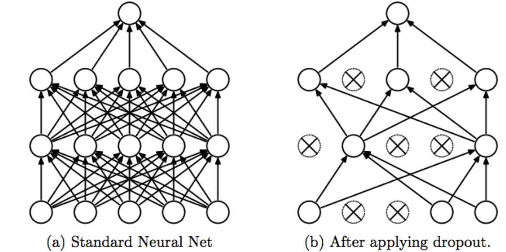
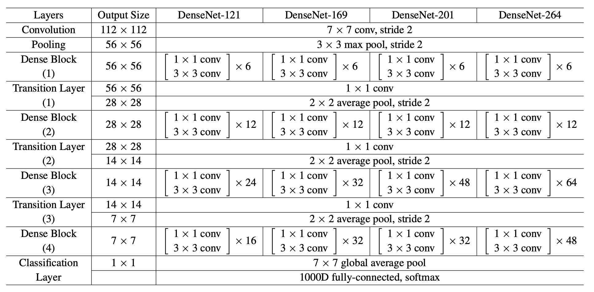

## CNN

### Convolution layer
Convolutional layers are the main **building blocks** of CNNs. They work by taking the **dot product** with a set of **filters** and a **sliding window** of the input image. The result is a set of local **features**, like edges and constrast, that can be helpful in describing the images. The learnable parameters are only the **weights** contained in the filters and due to their small size, these layers can be implemented quite **effeciently**

### Convolution Operation
It is nothing but component wise multiplication and addition

 

### Pooling Layer
The primary function of the pooling layer is to **downsample** the image sizes, e.g. from 64x64 to 32x32. It works by partitioning the image into squares and applying a **non-linear transformation** over thoses squares. The most common types of pooling are **average pooling**, where the average is taken of each square, and **max pooling**, where the maximum is taken of each square.

 

### Activation Function

 

Activation functions apply a **non-linear transformation** to the previous later, which enable the model to **learn more complex relationships**. Common activation functions are the **Rectified Linear Unit (ReLU)**, hyperbolic tan (tanh) and sigmoid. For the final layer, **softmax** can be used to produce predicted class probabilities.

### Dense layer

 

Dense or **fully connected** layers are the standard layers in a neural network, where every neuron in the previous layer is connected to the current layer through weights and biases. 

### Dropout

 

Dropout is a clever way to **prevent** your model from **overfitting** the training data by **randomly 'turning off'** each neuron **independently** with some probability p. The result is that the model cannot rely on any particular neuron and instead has to make predictions using several different neurons. 

### Data Augmentation

Training deep convolutional networks with a limited dataset can be challenging due to overfitting. To overcome this, AlexNet used the data augmentation approach to increase the size of the training dataset artificially. Data augmentation creates new images by randomly altering the original images. Alterations include cropping, flipping, rotating, adding noise, and changing the colors of the original images.

The data augmentation approach significantly increases the size and quality of the training dataset in the AlexNet model, leading to increased generalization, improved training speed and accuracy, and addressing overfitting

# Transfer Learning

Transfer Learning as Fine Tuning

1. Use Pre-trained Model: Start with a model already trained on a large dataset.
2. Freeze Early Layers: Prevent early layers from being updated to retain learned general features.
3. Replace Final Layers: Adapt the model to your specific task by modifying the final layers.
4. Train on New Data: Train the modified model on your specific dataset.
5. Optional Unfreezing: Unfreeze some layers and fine-tune with a lower learning rate.

## VGG16

VGG16 is a popular convolutional neural network (CNN) architecture that was designed by the Visual Geometry Group (VGG) from the University of Oxford. It is known for its simplicity and depth, which made it a significant model in the development of deep learning techniques for image classification. Here's an overview of the VGG16 architecture:

__Key Features of VGG16__
**Depth:** VGG16 consists of 16 layers that have weights. These layers include 13 convolutional layers and 3 fully connected layers.

__Convolutional Layers:__
The network uses very small receptive fields (3x3 filters) throughout the convolutional layers.
Convolutional layers are stacked on top of each other in increasing depth. The depth of the network increases from 64 to 128, 256, 512, and finally 512 feature maps.

__Pooling Layers:__
Max pooling is performed over a 2x2 pixel window, with a stride of 2.
Pooling layers are interspersed between groups of convolutional layers to progressively reduce the spatial dimensions of the feature maps.
Fully Connected Layers:

The three fully connected layers follow the convolutional layers. The first two have 4096 channels each, while the third performs 1000-way ILSVRC classification and thus contains 1000 channels (one for each class).
The final layer is a softmax layer to output the class probabilities.

__Activation Function:__
ReLU (Rectified Linear Unit) activation function is used after every convolution and fully connected layer.

__Input:__
The input to VGG16 is a fixed-size 224x224 RGB image.
Preprocessing involves subtracting the mean RGB value from each pixel.

# ResNet50

The ResNet-50 architecture is a deep convolutional neural network designed to address the vanishing gradient problem, allowing the construction and training of very deep networks. Here's a detailed overview of its architecture:

__Layers Breakdown__

__Initial Convolution and Max Pooling Layers:__
__Conv1:__  7x7 convolution with 64 filters, stride 2, followed by batch normalization and ReLU activation.
__Max Pooling:__ 3x3 max pooling with a stride of 2.

__Residual Blocks (Building Blocks):__

The core component of ResNet-50 is the residual block, which typically consists of three convolutional layers.
Each block can be represented as Conv3x3 -> Conv3x3 -> Conv1x1, with a shortcut connection adding the input of the block to its output.
Convolutional Layers by Stage:

__Stage 2:__
3 residual blocks, each containing:
1x1 convolution with 64 filters.
3x3 convolution with 64 filters.
1x1 convolution with 256 filters.

__Stage 3:__
4 residual blocks, each containing:
1x1 convolution with 128 filters.
3x3 convolution with 128 filters.
1x1 convolution with 512 filters.

__Stage 4:__ 
6 residual blocks, each containing:
1x1 convolution with 256 filters.
3x3 convolution with 256 filters.
1x1 convolution with 1024 filters.

__Stage 5:__
3 residual blocks, each containing:
1x1 convolution with 512 filters.
3x3 convolution with 512 filters.
1x1 convolution with 2048 filters.

Fully Connected Layer:

After the convolutional stages, a global average pooling layer is applied to reduce the spatial dimensions to 1x1.
A fully connected layer with 1000 neurons (for 1000 classes in the ImageNet dataset) follows, ending with a softmax activation function for classification.

__Architecture Diagram__

Conv1: 7x7, 64, stride 2
Max Pooling: 3x3, stride 2
Stage 2: 3x (1x1, 64) -> (3x3, 64) -> (1x1, 256)
Stage 3: 4x (1x1, 128) -> (3x3, 128) -> (1x1, 512)
Stage 4: 6x (1x1, 256) -> (3x3, 256) -> (1x1, 1024)
Stage 5: 3x (1x1, 512) -> (3x3, 512) -> (1x1, 2048)
Global Average Pooling
Fully Connected Layer (1000 classes)

__Key Concepts__
Residual Learning: The key idea is to let the layers fit a residual mapping instead of directly trying to fit the desired underlying mapping. This is done using shortcut connections that skip one or more layers.
Bottleneck Design: Each residual block uses a bottleneck design, which consists of three layers instead of the standard two-layer design to make the network more efficient and deeper.

# InceptionV3

__Inception v3 Architecture Summary__

Inception v3 is a deep convolutional neural network designed for image classification tasks. It builds upon the earlier Inception models (v1 and v2) with several improvements to enhance performance and efficiency.

__Key Components:__

Factorized Convolutions:

Breaks down larger convolutions into smaller ones (e.g., 3x3 into two 1x3 and 3x1), reducing computational cost and the number of parameters.

__Asymmetric Convolutions:__

Uses two consecutive 3x3 convolutions instead of a single 5x5 convolution, maintaining the receptive field with less computational expense.

__Auxiliary Classifiers:__

Adds auxiliary classifiers at intermediate layers to help combat the vanishing gradient problem and provide regularization.
Efficient Grid Size Reduction:
Combines convolutions and pooling layers to effectively reduce the spatial dimensions of feature maps.

__Label Smoothing:__

Applies label smoothing to improve generalization by preventing the network from becoming too confident in its predictions.
Architecture Breakdown:

__Stem:__

Initial layers with convolutions and pooling to preprocess the input image and reduce its dimensions.
Inception Modules:

Stacked modules that apply various convolution filters and pooling operations:

__Inception Module A:__ Combines 1x1, 3x3, and 5x5 convolutions with pooling.
__Inception Module B:__ Uses factorized convolutions like 1x7 followed by 7x1.
__Inception Module C:__ Further factorizes convolutions and combines multiple branches.

__Reduction Modules:__

Special modules to reduce spatial dimensions while increasing depth:
Reduction Module A and Reduction Module B.
Auxiliary Classifier:

An intermediate classifier to provide additional gradient signals during training.
Global Average Pooling:

Reduces each feature map to a single value by averaging over spatial dimensions.
Fully Connected Layer:

A dense layer followed by a softmax layer for final classification.

# MobileNet

#### Steps in Depthwise Convolution
1. Separation of Channels: Standard convolution applies filters to each channel of the input image. Whereas depthwise convolution only applies a single filter per input channel.
2. Filter Application: As each filter is applied independently, the output is the result of convolving (multiplication and summation) a single input channel with a dedicated filter.
3. Output Channels: The output of the depthwise convolution has the same number of channels as the input.
4. Reduced Complexity: Compared to standard convolution, the total number of multiplicative operations is reduced.
For standard convolution the total number of multiplicative operations = 𝐾×𝐾×𝐶×𝐷×height×width
For depthwise convolution, the number of operations = 𝐾×𝐾×𝐶× height×width

#### Pointwise Convolution

To combine features or expand channels, the output of depthwise convolution is applied with pointwise convolution. This is a 1×1 filter, which is applied to each pixel. This combines or expands the channels.

Combining Channel Features: Depthwise convolution processes each input channel separately, therefore interaction between channels doesn’t happen. Pointwise convolution combines these independently processed channel features to create a new feature map. This allows the model to learn from the entire depth of feature maps.

Increases Model Capacity: The interactions between the channels increase the representational capacity of the network. The model can learn complex patterns that depend on the relationships between different feature channels.
Adjusting the Number of Channels: Pointwise convolution enables increasing or decreasing the number of channels in the output feature map.

# XceptionNet
The Xception network is a deep convolutional neural network architecture that improves on the Inception model by using depthwise separable convolutions, which are more efficient. 
It was developed by François Chollet and is known for its high performance in image classification tasks. 
The architecture consists of 36 convolutional layers structured into 14 modules, with linear residual connections, making it both powerful and computationally efficient. Xception is widely used for 
tasks like image classification and transfer learning.

# DenseNet

#### Dense Connections:

Unlike traditional convolutional networks, where each layer has its own set of weights and the output from one layer is passed to the next layer, DenseNet connects each layer to every other layer in a feed-forward fashion.

Specifically, each layer receives the feature maps of all preceding layers as input. This is achieved by concatenating the output feature maps of the previous layers.

__Feature Reuse:__

1. Due to the dense connections, DenseNet allows feature reuse. This means that the network can leverage the features learned by earlier layers, making the network more efficient and reducing the number of parameters.
Fewer Parameters:

2. Despite being deep, DenseNet often has fewer parameters compared to other architectures like ResNet because it doesn't need to learn redundant features multiple times. This makes DenseNet more parameter-efficient.

__Composite Function:__

1. Each layer in a DenseNet typically performs a series of operations: Batch Normalization, followed by a ReLU activation, and then a convolution operation.

__Dense Blocks and Transition Layers:__

1. __Dense Block:__

A series of layers where each layer is connected to every other layer in a dense manner.

__Transition Layer:__

Between two dense blocks, there is a transition layer that includes a batch normalization layer, a 1x1 convolutional layer (to reduce the number of channels), and a 2x2 average pooling layer (to reduce the size of feature maps).

__Growth Rate:__

The growth rate (k) in DenseNet determines the number of filters added by each layer. If the growth rate is 32, each layer adds 32 feature maps. The growth rate controls how quickly the number of feature maps increases as layers are added.

__Common Variants:__

DenseNet is commonly used in several variants based on the depth and growth rate. Examples include:

1. DenseNet-121: 121 layers deep.
2. DenseNet-169
3. DenseNet-201
4. DenseNet-264

#Results

